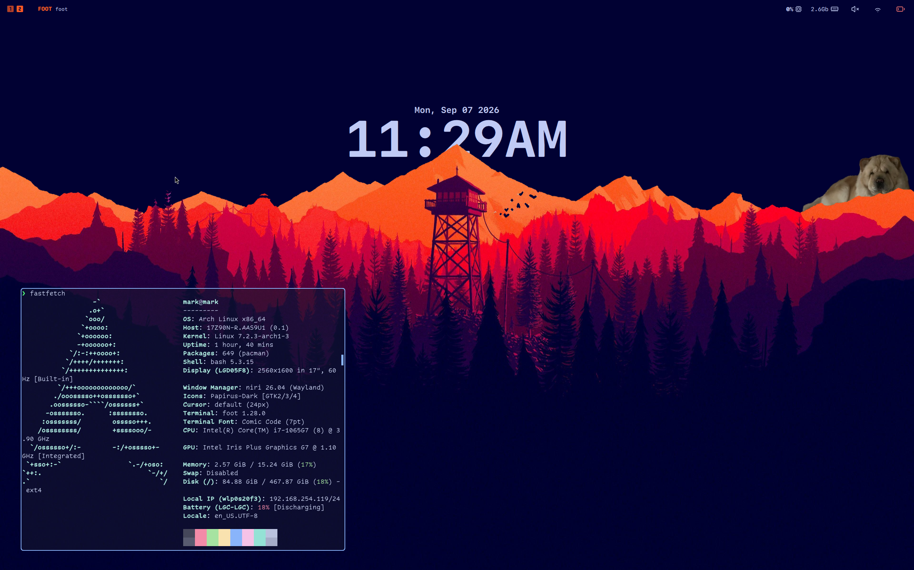
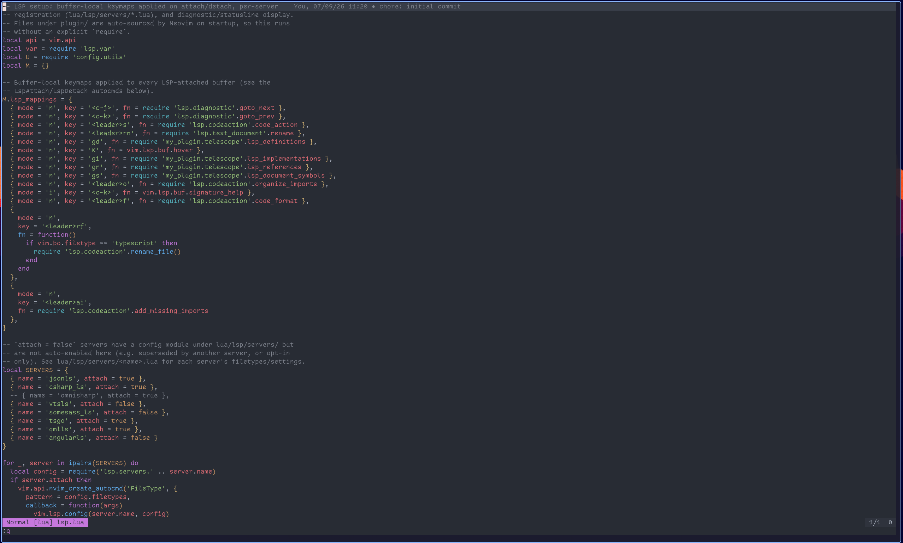

# dotfiles

Personal configuration for a Wayland desktop built on [niri](https://github.com/YaLTeR/niri) (scrolling-tile compositor) and [Quickshell](https://quickshell.outfoxxed.me/) (status bar/shell), themed mostly in Catppuccin/Dracula-ish palettes with `Comic Code` as the primary font.

This directory is expected to live at (or be symlinked from) `~/.mark/config`, exported as `$CONFIG_PATH`. Several configs (niri binds, scripts) reference `$CONFIG_PATH` directly, so that env var must be set before niri starts.

## Screenshots

| niri | Quickshell | nvim |
|---|---|---|
|  |  |  |

## Layout

| Path | What it is |
|---|---|
| [`niri/`](niri/README.md) | Window manager config — binds, layout, animations, window/layer rules, startup scripts |
| [`quickshell/`](quickshell/README.md) | Desktop shell (QML) — topbar, wallpaper, notifications |
| [`nvim/`](nvim/README.md) | Neovim config — `vim.pack`-based plugin management, LSP, custom UI |
| `kitty/` | Terminal emulator config + Catppuccin theme (`themes/catppuccin`) |
| `foot/` | Terminal emulator config, plus a `minimal_foot.ini` variant bound separately in niri |
| `wofi/` | App launcher / clipboard picker styling (`style.css`) |
| `mpv/` | Video player config (mostly commented-out reference options) |
| `satty/` | Screenshot annotation tool config — used by niri's screenshot bind |
| `yazi/` | Terminal file manager config, keymap, and Catppuccin/Dracula flavors |
| `chromium-flags.conf` | Flags for Chromium/Electron apps under Wayland (Ozone, PipeWire screen capture) |

See each subdirectory's own README for details — `niri`, `quickshell`, and `nvim` are the largest pieces and are documented in depth.

## Theming

No single shared theme file — colors are duplicated per app:

- **Catppuccin Mocha** — niri (focus ring, borders), kitty (`themes/catppuccin`), yazi flavors
- **Dracula**-ish purples (`#bd93f9`, `#282a36`, `#44475a`) — wofi
- **Comic Code** — primary font across foot, kitty, and satty

## Key apps wired together

- Screenshots: `Print` in niri → `wayfreeze` + `grim` + `slurp` → `satty` (annotate) → clipboard/file
- Clipboard history: `wl-paste` watchers (started by niri) → `cliphist` → `wofi` (`Mod+C`)
- Terminals: `foot` (default/minimal) and `kitty` (`Mod+B`), both launched by niri binds
- Screen sharing: niri's `scripts/desktop-portal` sets up `xdg-desktop-portal`; `chromium-flags.conf` enables PipeWire capture in Chromium-based apps

## Notes

- `nvim/swap/` contains leftover `.swp` files from past sessions — swapfile writing itself is disabled in the nvim config.
- `kitty/kitty.conf.bak` is a backup, not loaded by kitty.
- `mpv/mpv.conf` is largely the stock example config with most options commented out; only `fs=yes` is active.
